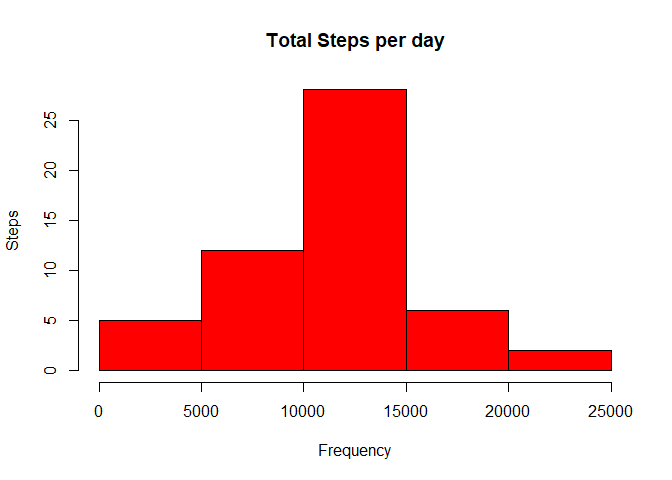
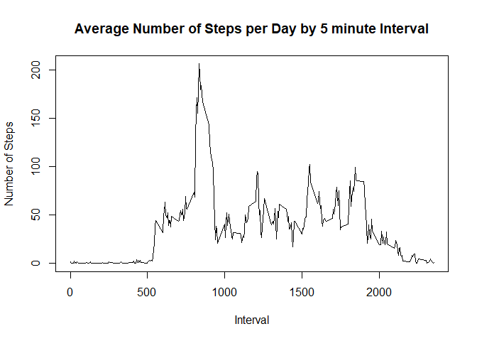
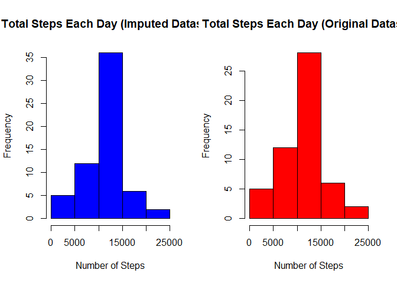
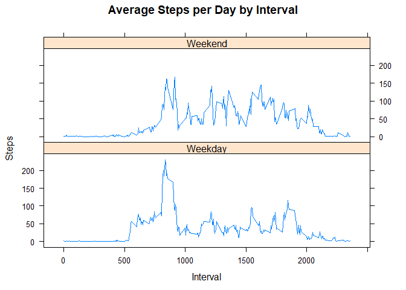

## Loading and preprocessing the data
In this part we will read tha data into environment and show part of the data 

```r
unzip('activity.zip')

data <- read.csv("activity.csv")

head(data)
```

```
##   steps       date interval
## 1    NA 2012-10-01        0
## 2    NA 2012-10-01        5
## 3    NA 2012-10-01       10
## 4    NA 2012-10-01       15
## 5    NA 2012-10-01       20
## 6    NA 2012-10-01       25
```

## What is mean total number of steps taken per day?


```r
daily_steps<- aggregate(steps ~ date, data, FUN=sum)

head(daily_steps)
```

```
##         date steps
## 1 2012-10-02   126
## 2 2012-10-03 11352
## 3 2012-10-04 12116
## 4 2012-10-05 13294
## 5 2012-10-06 15420
## 6 2012-10-07 11015
```

```r
hist(daily_steps$steps, 
     col="red", 
     xlab = "Frequency", 
     ylab = "Steps",
     main = "Total Steps per day")
```

<!-- -->

```r
daily_mean <- mean(daily_steps$steps)
daily_median <- median(daily_steps$steps)

daily_mean
```

```
## [1] 10766.19
```

```r
daily_median
```

```
## [1] 10765
```
## What is the average daily activity pattern?


```r
steps_by_interval <- aggregate(steps ~ interval, data, mean)

plot(steps_by_interval$interval, 
     steps_by_interval$steps,
     type="l",
     xlab="Interval", 
     ylab="Number of Steps",
     main="Average Number of Steps per Day by 5 minute Interval")
```

<!-- -->

```r
max_interval <- steps_by_interval[which.max(steps_by_interval$steps),1]

max_interval
```

```
## [1] 835
```
## Imputing missing values


```r
table(is.na(data))
```

```
## 
## FALSE  TRUE 
## 50400  2304
```

```r
#determine incomplete cases/observations
incomplete <- sum(!complete.cases(data))

#Missing values were imputed by inserting the average for each interval.
imputed_data <- transform(data, 
                          steps = ifelse(is.na(data$steps),
                          steps_by_interval$steps[match(data$interval,
                          steps_by_interval$interval)], 
                          data$steps))

table(is.na(imputed_data$steps))
```

```
## 
## FALSE 
## 17568
```

```r
daily_steps_imputed <- aggregate(steps ~ date, imputed_data, sum)

par(mfrow=c(1,2))
hist(daily_steps_imputed$steps, 
     main = paste("Total Steps Each Day (Imputed Datased)"), 
     col="blue", 
     xlab="Number of Steps")


hist(daily_steps$steps, 
     main = paste("Total Steps Each Day (Original Dataset)"), 
     col="red", 
     xlab="Number of Steps")
```

<!-- -->

```r
daily_mean_imputed <- mean(daily_steps_imputed$steps)
daily_median_imputed <- median(daily_steps_imputed$steps)

daily_mean_imputed
```

```
## [1] 10766.19
```

```r
daily_median_imputed
```

```
## [1] 10766.19
```

```r
mean_diff <- daily_mean_imputed - daily_mean

median_diff <- daily_median_imputed - daily_median

mean_diff
```

```
## [1] 0
```

```r
median_diff
```

```
## [1] 1.188679
```
## Are there differences in activity patterns between weekdays and weekends?

```r
weekdays <- c("Monday","Tuesday", "Wednesday", "Thursday","Friday")
imputed_data$dow <- as.factor(
                      ifelse(
                        is.element(weekdays(as.Date(imputed_data$date)),weekdays),
                      "Weekday", 
                      "Weekend")
                    )


steps_by_interval_dow <- aggregate(steps ~ interval + dow, imputed_data, mean)

library(lattice)

xyplot(steps_by_interval_dow$steps ~ steps_by_interval_dow$interval | steps_by_interval_dow$dow, 
       main="Average Steps per Day by Interval",
       xlab="Interval", 
       ylab="Steps",
       layout=c(1,2), 
       type="l")
```

<!-- -->
